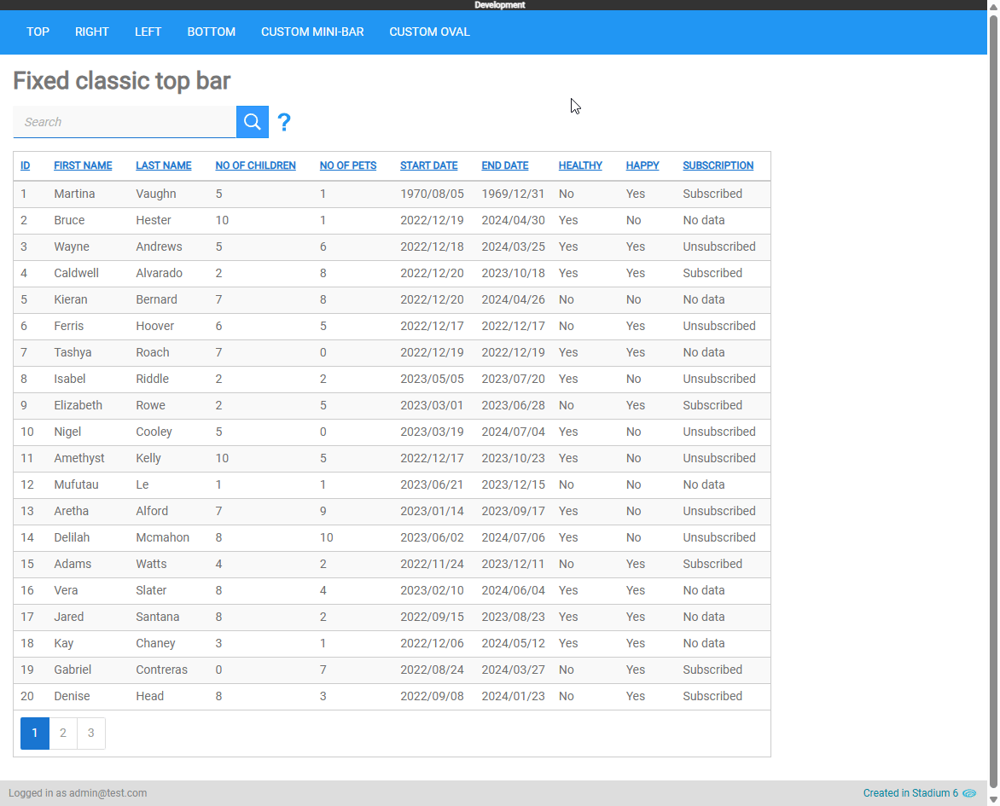
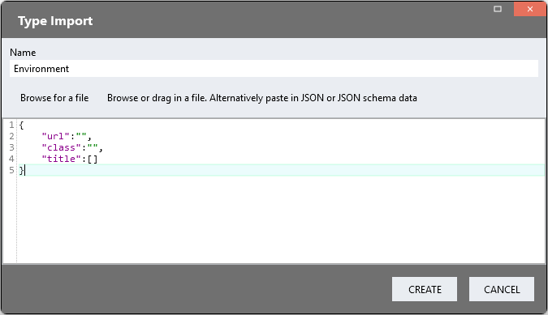
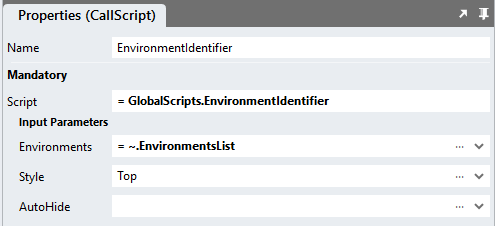

# Environment Identifier

Some applications are published to multiple environments, such as 'development', 'staging', 'UAT' or 'production'. 
As the applications commonly look alike, users can get confused as to which environment they have logged into. 
This module adds an element and label to application pages so users can quickly identify an environment. 



## Version
3.0 Integrated CSS with script; re-added ability to use built-in positioning; changed style input variable name

# Global Script Setup
1. Create a Global Script called "EnvironmentIdentifier"
2. Add the input parameters below to the Global Script
   1. Environments
   2. AutoHide
   3. Style
3. Drag a *JavaScript* action into the script
4. Add the Javascript below unchanged into the JavaScript code property
```javascript
/* Stadium Script 3.0 https://github.com/stadium-software/environment-identifier */
let environments = ~.Parameters.Input.Environments;
if (!Array.isArray(environments)) environments = [];
let autoHide = ~.Parameters.Input.AutoHide;
if (autoHide != "true" && autoHide != true) autoHide = false;
let position = ~.Parameters.Input.Style;
let cssClass;
if (position && ["top", "right", "bottom", "left"].includes(position.toLowerCase())) {
    position = position.toLowerCase();
} else if (position) {
    cssClass = position;
    position = null;
} else {
    position = "top";
}
let environmentIndicator = document.querySelector(".environment-indicator");
for (let i = 0; i < environments.length; i++) {
    if (window.location.href.indexOf(environments[i].url) > -1 && !environmentIndicator) {
        environmentIndicator = document.createElement('div');
        environmentIndicator.classList.add(environments[i].class, "environment-indicator");
        if (position) environmentIndicator.classList.add("environment-indicator-" + position);
        if (position && !autoHide) environmentIndicator.classList.add("environment-indicator-fixed");
        if (cssClass) environmentIndicator.classList.add(cssClass);
        environmentIndicator.textContent = environments[i].title;
        document.querySelector(".container").appendChild(environmentIndicator);
    }
}
if (autoHide) {
    document.querySelector(".container").addEventListener(`mousemove`, mouseMoved);
}
let timer;
function mouseMoved() {
    let ev = document.querySelector(".environment-indicator");
    if (ev) ev.style.display = "none";
    clearTimeout(timer);
    timer = setTimeout(mouseStopped, 1000);
}
function mouseStopped() {
    let ev = document.querySelector(".environment-indicator");
    if (ev) ev.style.display = "grid";
}
loadCSS();
function loadCSS() {
    let moduleID = "stadium-environments";
    if (!document.getElementById(moduleID)) {
        let cssMain = document.createElement("style");
        cssMain.id = moduleID;
        cssMain.type = "text/css";
        cssMain.textContent = `.environment-indicator {
    position: fixed;
    display: flex;
    flex-wrap: wrap;
    align-content: center;
    justify-content: center;
    z-index: 1100;
    user-select: none;
    font-size: 1rem;
    font-weight: bold;
}
.container:has(.environment-indicator-top:is(.environment-indicator-fixed)) {
    padding-top: var(--environment-bar-size, 1.2rem);
}
.environment-indicator-top {
    width: 100vw;
    height: var(--environment-bar-size, 1.2rem);
    top: 0;
}
.container:has(.environment-indicator-bottom:is(.environment-indicator-fixed)) {
    padding-bottom: var(--environment-bar-size, 1.2rem);
}
.environment-indicator-bottom {
    width: 100vw;
    height: var(--environment-bar-size, 1.2rem);
    bottom: 0;
}
.container:has(.environment-indicator-right:is(.environment-indicator-fixed)) {
    padding-right: var(--environment-bar-size, 1.2rem);
}
.environment-indicator-right {
    top: 0;
    right: 0;
    writing-mode: vertical-rl;
    text-orientation: upright;
    height: 100vh;
    width: var(--environment-bar-size, 1.2rem);
}
.container:has(.environment-indicator-left:is(.environment-indicator-fixed)) {
    padding-left: var(--environment-bar-size, 1.2rem);
}
.environment-indicator-left {
    top: 0;
    left: 0;
    writing-mode: vertical-rl;
    text-orientation: upright;
    height: 100vh;
    width: var(--environment-bar-size, 1.2rem);
}

html {
    min-height: 100%;
    font-size: 62.5%;
}`;
        document.head.appendChild(cssMain);
    }   
}
```

## Type Setup
Create a type called "Environment"


#### Manual Type Creation
1. Add a type called "Environment" to the types collection in the Stadium Application Explorer
2. Add the following properties to the type
   1. url (Any)
   2. class (Any)
   3. title (Any)

#### Type Import
1. Right-click on the `Types` node in the `Application Explorer`


2. In the `Import Type` popup
    1. Add "Environment" into the `Name` input field
    2. Copy & paste the JSON below into the main input area

```json
{
    "url":"",
    "class":"",
    "title":[]
}
```



## Template.Load or Page.Load Setup
1. Drag a *List* action into the Load event handler of Templates or Pages where the environment element must be shown
2. Call the List "EnvironmentsList"
3. Assign the *Environment* type to the *List*
4. Define the environments
   1. *url*: the url of the environment or part thereof (e.g. localhost)
   2. *class*: a class that will be attached to the environment identifying element when the url input matches the url in the address bar
   3. *title*: the name of the environment. This will be shown inside the environment identifier

Environments List Example
```json
[{
	"url": "stadium.software/staging",
	"class": "staging",
	"title": "Staging"
},{
	"url": "uat.stadium.software",
	"class": "uat",
	"title": "UAT"
},{
	"url": "localhost",
	"class": "development",
	"title": "Development"
}]
```
5. Drag the "EnvironmentIdentifier" global script into the Event Handler (below the *List*)
6. Enter parameters for the script
   1. Environments: Select the List containing the environments defined above from the dropdown
   2. Style: Add the location to use the default wull-width bar or add a class and some CSS to create your own style
      1. Add one of the following values to use the default full-width bar (top is the default):
         1. top
         2. right
         3. bottom
         4. left
      2. Add a class with some CSS to your stylesheet and reference the classname in the `Style` parameter to use a custom style
   3. AutoHide (boolean): When set to true, the environment indicator is hidden while the user moves the mouse (default is `false`)



## Environments Styling
CSS is needed in the Stylesheet for each environment class defined in the "EnvironmentsList". Here you can define what the environment identifier will look like in each environment. 

For example: 

```css
.staging {
	background-color: #924370;
	color: white;
}
.uat {
	background-color: #97F48A;
	color: #555;
}
.development {
	background-color: #333;
	color: #fff;
}
```

## Custom Environment Indicators
Environment indicators can be also be custom styled by adding a class in the `Style` parameter and adding a class to the stylesheet that defines the look of that style. 

**Example styles**

### Floating oval (top right)
```css
.oval {
	position: fixed;
	top: 0.4rem;
	right: 2.5rem;
	border-radius: 50%;
	width: auto;
	height: 2rem;
	padding: 14px;
	z-index: 2000;
    user-select: none;
	display: grid;
	place-content: center;
	box-shadow: rgba(0, 0, 0, 0.25) 0px 54px 55px, rgba(0, 0, 0, 0.12) 0px -12px 30px, rgba(0, 0, 0, 0.12) 0px 4px 6px, rgba(0, 0, 0, 0.17) 0px 12px 13px, rgba(0, 0, 0, 0.09) 0px -3px 5px;
}
```

Floating oval with Auto-Hide on


### Minimal bar (top)
```css
.mini-bar {
    position: fixed;
    display: flex;
    flex-wrap: wrap;
    align-content: center;
    justify-content: center;
    width: 200px;
    height: 10px;
    z-index: 1100;
    user-select: none;
    top: 0;
    left: calc(50% - 100px);
    border-radius: 6px;
}
```

Minimal Bar with Auto-Hide off


## CSS
Variables exposed in the [*environments-variables-variables.css*](environments-variables-variables.css) file can be [customised](#customising-css). Including the CSS file below is only necessary when customisations need to be made. 

### Customising CSS
1. Open the CSS file called [*environments-variables-variables.css*](environments-variables-variables.css) from this repo
2. Adjust the variables in the *:root* element as you see fit
3. Stadium 6.12+ users can comment out any variable they do **not** want to customise
4. Add the [*environments-variables-variables.css*](environments-variables-variables.css) to the "CSS" folder in the EmbeddedFiles (overwrite)
5. Paste the link tag below into the *head* property of your application (if you don't already have it there)
```html
<link rel="stylesheet" href="{EmbeddedFiles}/CSS/environments-variables-variables.css">
``` 
6. Add the file to the "CSS" inside of your Embedded Files in your application

## Upgrading Stadium Repos
Stadium Repos are not static. They change as additional features are added and bugs are fixed. Using the right method to work with Stadium Repos allows for upgrading them in a controlled manner. 

How to use and update application repos is described here: [Working with Stadium Repos](https://github.com/stadium-software/samples-upgrading)

## Known Issues
When using other elements with a CSS attribute of `position:fixed`, there may be some overlap. 
