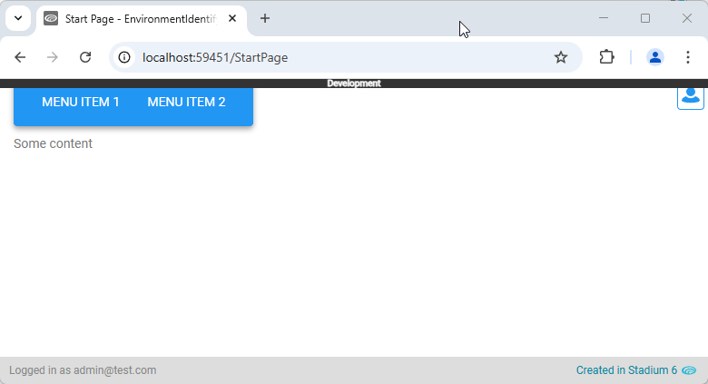
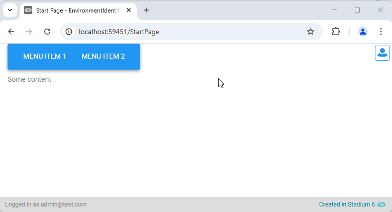
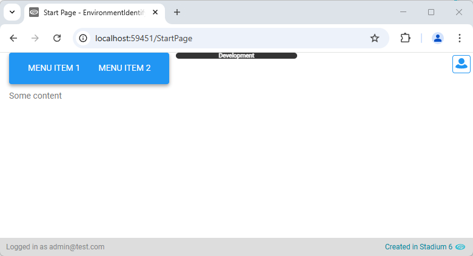

# Environment Identifier

Some applications are published to multiple environments, such as 'development', 'staging', 'UAT' or 'production'. 
As the applications commonly look alike, users can get confused as to which environment they have logged into. 
This module adds an element and label to application pages so users can quickly identify an environment. 


## Version
2.0 Allows for custom indicator styling; added optional auto-hide

# Global Script Setup
1. Create a Global Script called "EnvironmentIdentifier"
2. Add the input parameters below to the Global Script
   1. Environments
   2. AutoHide
3. Drag a *JavaScript* action into the script
4. Add the Javascript below unchanged into the JavaScript code property
```javascript
/* Stadium Script 2.0 https://github.com/stadium-software/environment-identifier */
let environments = ~.Parameters.Input.Environments;
if (!Array.isArray(environments)) environments = [];
let autoHide = ~.Parameters.Input.AutoHide || false;
let environmentIndicator = document.querySelector(".environment-indicator");
for (let i = 0; i < environments.length; i++) {
    if (window.location.href.indexOf(environments[i].url) > -1 && !environmentIndicator) {
        let environmentIndicator = document.createElement('div');
        environmentIndicator.classList.add(environments[i].class, "environment-indicator");
        environmentIndicator.textContent = environments[i].title;
        document.querySelector(".container").appendChild(environmentIndicator);
    }
}
if (autoHide) {
    let timer;
    document.addEventListener(`mousemove`, () => {
        let ev = document.querySelector(".environment-indicator");
	    if (ev) ev.style.display = "none";
	    clearTimeout(timer);
	    timer = setTimeout(mouseStopped, 1000);
	});
}
function mouseStopped(){
    let ev = document.querySelector(".environment-indicator");
    if (ev) ev.style.display = "grid";
}
```

## Type Setup
1. Add a type called "Environment" to the types collection in the Stadium Application Explorer
2. Add the following properties to the type
   1. url (Any)
   2. class (Any)
   3. title (Any)


## Template.Load or Page.Load Setup
1. Drag a *List* action into the Load event handler of Templates or Pages where the environment element must be shown
2. Call the List "EnvironmentsList"
3. Assign the *Environment* type to the *List*
4. Define the environments
   1. *url*: the url of the environment or part thereof (e.g. localhost)
   2. *class*: a class that will be attached to the environment identifying element when the url input matches the url in the address bar
   3. *title*: the name of the environment. This will be shown inside the environment identifier

Environments List Example
```json
= [{
	"url": "stadium.software/staging",
	"class": "staging",
	"title": "Staging"
},{
	"url": "uat.stadium.software",
	"class": "uat",
	"title": "UAT"
},{
	"url": "localhost",
	"class": "development",
	"title": "Development"
}]
```
5. Drag the "EnvironmentIdentifier" global script into the Event Handler (below the *List*)
6. Enter parameters for the script
   1. Environments: Select the List containing the environments defined above from the dropdown
   2. AutoHide (boolean): When set to true, the environment indicator is hidden while the user moves the mouse


## Environment Indicator Styling
While version 1 of this module provided for a fixed bar on the page, this module does not prescribe a specific display style for the environment indicator. While this allows for the indicator to be flexibly displayed using any style, it also means that CSS needs to be added to the application stylesheet to define a style. 

**Example styles**

Classic top bar (top)
```css
.environment-indicator {
    position: fixed;
    display: flex;
    flex-wrap: wrap;
    align-content: center;
    justify-content: center;
    width: 100vw;
	margin-left: -15px;
    height: 0.5rem;
    z-index: 1100;
    user-select: none;
    top: 0; 
	/* bottom:0; to place at bottom */
}
```



Floating oval (top right)
```css
.environment-indicator {
	position: fixed;
	top: 0.4rem;
	right: 2.5rem;
	border-radius: 50%;
	width: 6rem;
	height: 2rem;
	z-index: 2000;
    user-select: none;
	display: grid;
	place-content: center;
	box-shadow: rgba(0, 0, 0, 0.25) 0px 54px 55px, rgba(0, 0, 0, 0.12) 0px -12px 30px, rgba(0, 0, 0, 0.12) 0px 4px 6px, rgba(0, 0, 0, 0.17) 0px 12px 13px, rgba(0, 0, 0, 0.09) 0px -3px 5px;
}
```



Minimal bar (top)
```css
.environment-indicator {
    position: fixed;
    display: flex;
    flex-wrap: wrap;
    align-content: center;
    justify-content: center;
    width: 200px;
    height: 10px;
    z-index: 1100;
    user-select: none;
    top: 0;
    left: calc(50% - 100px);
    border-radius: 6px;
}
```



## Environments Custom Styling
Additionally, CSS is needed in the Stylesheet for each environment class you defined in the "EnvironmentsList". Here you can define what the environment identifier will look like in each environment. 

For example: 

```css
.staging {
	background-color: #924370;
	color: white;
	font-size: 10px;
	font-weight: bold;
}
.uat {
	background-color: #97F48A;
	color: #555;
	font-size: 10px;
	font-weight: bold;
}
.development {
	background-color: #333;
	color: #fff;
	font-size: 10px;
	font-weight: bold;
}
```

## Upgrading Stadium Repos
Stadium Repos are not static. They change as additional features are added and bugs are fixed. Using the right method to work with Stadium Repos allows for upgrading them in a controlled manner. 

How to use and update application repos is described here: [Working with Stadium Repos](https://github.com/stadium-software/samples-upgrading)