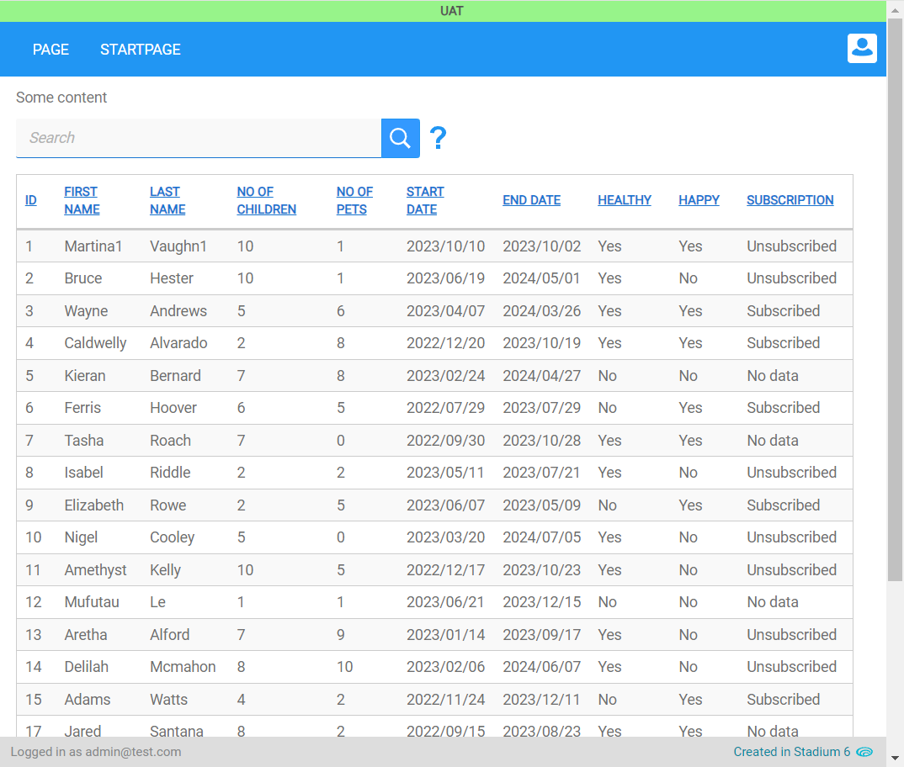
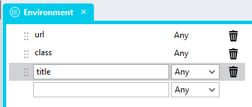
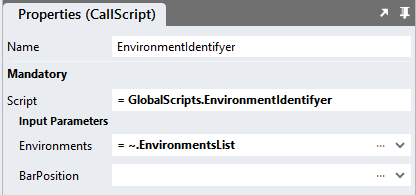

# Environment Identifier

Some applications are published to multiple environments, such as 'development', 'staging', 'UAT' or 'production'. 
As the applications commonly look alike, users can get confused as to which environment they have logged into. 
This module adds an element and label to application pages so users can quickly identify an environment. 



## Version
1.0 - initial

1.1 Fixed script bug - change 'text' to 'title'

1.2 Optimised script code

# Global Script Setup
1. Create a Global Script called "EnvironmentIdentifier"
2. Add the input parameters below to the Global Script
   1. BarPosition
   2. Environments
3. Drag a *JavaScript* action into the script
4. Add the Javascript below into the JavaScript code property
```javascript
/* Stadium Script 1.2 https://github.com/stadium-software/environment-identifier */
let position = ~.Parameters.Input.BarPosition || "top";
let environments = ~.Parameters.Input.Environments;
if (!['top', 'right', 'bottom', 'left'].includes(position)) {
	position = 'top';
}
for (let i = 0; i < environments.length; i++) {
    if (window.location.href.indexOf(environments[i].url) > -1 && !document.body.querySelector(".environment-top-bar")) {
        let environmentBar = document.createElement('div');
        environmentBar.classList.add(environments[i].class, "environment-top-bar", "environment-top-bar-" + position);
        environmentBar.textContent = environments[i].title;
        document.body.appendChild(environmentBar);
        if (position == 'top') {
            let hd = document.querySelector('.header');
            hd.style.setProperty('top', 'calc(' + window.getComputedStyle(hd).getPropertyValue("top") + ' + ' + window.getComputedStyle(document.body).getPropertyValue("--environment-bar-size") + ')');
        }
    }
}
```

## Type Setup
1. Add a type called "Environment" to the types collection in the Stadium Application Explorer
2. Add the following properties to the type
   1. url (Any)
   2. class (Any)
   3. title (Any)



## Template.Load or Page.Load Setup
1. Drag a *List* action into the Load event handler of Templates or Pages where the environment element must be shown
2. Call the List "EnvironmentsList"
3. Assign the *Environment* type to the *List*
4. Define the environments
   1. *url*: the url of the environment or part thereof (e.g. localhost)
   2. *class*: a class that will be attached to the environment identifying element when the url input matches the url in the address bar
   3. *title*: the name of the environment. This will be shown inside the environment identifier

Environments List Example
```json
= [{
	"url": "stadium.software/staging",
	"class": "staging",
	"title": "Staging"
},{
	"url": "uat.stadium.software",
	"class": "uat",
	"title": "UAT"
},{
	"url": "localhost",
	"class": "development",
	"title": "Development"
}]
```
5. Drag the "EnvironmentIdentifier" global script into the Event Handler (below the *List*)
6. Enter parameters for the script
   1. BarPosition: the location where the bar will be shown. Supported are: top, left, right or bottom. The default is top
   2. Environments: Select the List containing the environments defined above from the dropdown



## Environments Custom Styling
Add CSS to the Stylesheet for each environment class you defined in the "EnvironmentsList". Here you can define what the environment identifier will look like. 

For example: 

```css
.staging {
	background-color: #924370;
	color: white;
	font-size: 12px;
	font-weight: bold;
}
.uat {
	background-color: #97F48A;
	color: #555;
	font-size: 12px;
	font-weight: bold;
}
.development {
	background-color: #333;
	color: #fff;
	font-size: 12px;
	font-weight: bold;
}
```

## Module CSS
Follow the instructions below to implement the module CSS (required for the correct functioning of the module). 
Some elements can be [customised](#customising-css) using a variables CSS file. 

1. Create a folder called "CSS" inside of your Embedded Files in your application
2. Drag the two CSS files from this repo [*environments-variables.css*](environments-variables.css) and [*environments.css*](environments.css) into that folder
3. Paste the link tags below into the "head" property of your application
```html
<link rel="stylesheet" href="{EmbeddedFiles}/CSS/environments.css">
<link rel="stylesheet" href="{EmbeddedFiles}/CSS/environments-variables.css">
``` 

## Customising the Module CSS
1. Open the CSS file called [*environments-variables.css*](environments-variables.css) from this repo
2. Adjust the variables in the *:root* element as you see fit
3. Overwrite the file in the CSS folder of your application with the customised file

## CSS Upgrading
To upgrade the CSS in this module, follow the [steps outlined in this repo](https://github.com/stadium-software/samples-upgrading)
